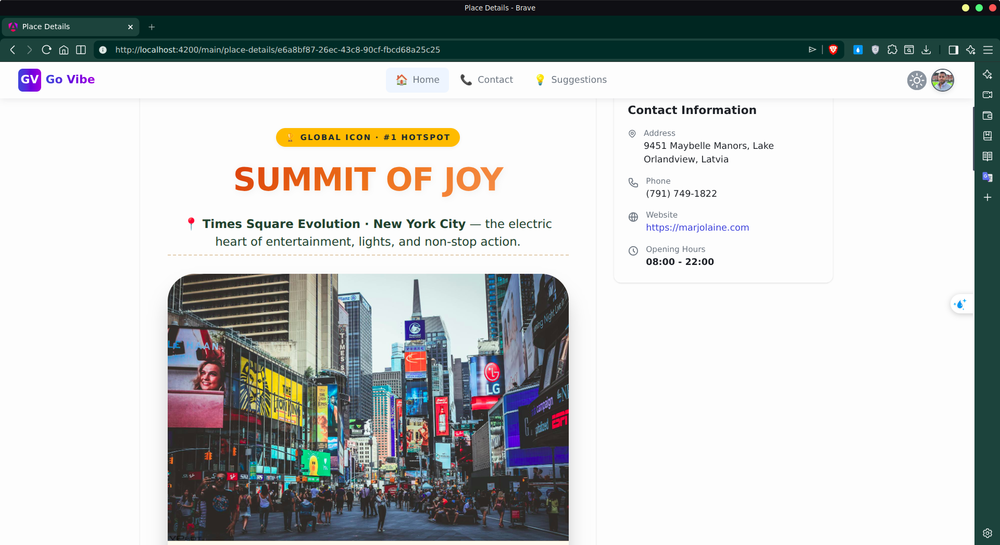
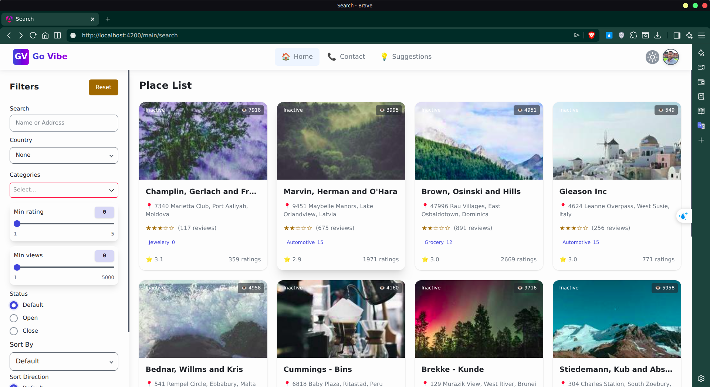

# GoVibe

**GoVibe is a platform that helps users discover places to eat, have fun, and explore entertainment — both locally and around the world.**

_It aims to provide a seamless experience for searching, exploring, and enjoying locations with modern technologies and scalable architecture._

## Demo




## Features

- Login with GG
- Smart search with fast results
- Discover local and global destinations
- Explore places for food, entertainment, and activities
- ⚡ Scalable microservices architecture

## Technologies

- **Backend:** .NET 8 (ASP.NET Core Web API)
- **Frontend:** Angular
- **Database:** PostgreSQL
- **API Gateway:** YARP (Yet Another Reverse Proxy)
- **Message Broker:** RabbitMQ (for inter-service communication)
- **Search Engine:** Elasticsearch

## Architecture (Overview)

GoVibe is built using a microservices architecture where services communicate asynchronously via RabbitMQ, ensuring scalability and flexibility.

## Getting Started

- clone

    ```bash
    git clone git@github.com:VinhTin-AQUA/GoVibe.gitcd
    ```

- backend: run all projects
- frontend

    ```bash
    cd GoVibe/GoVibe-Client
    npm i
    ng s dashboard
    ng s portal
    ```
